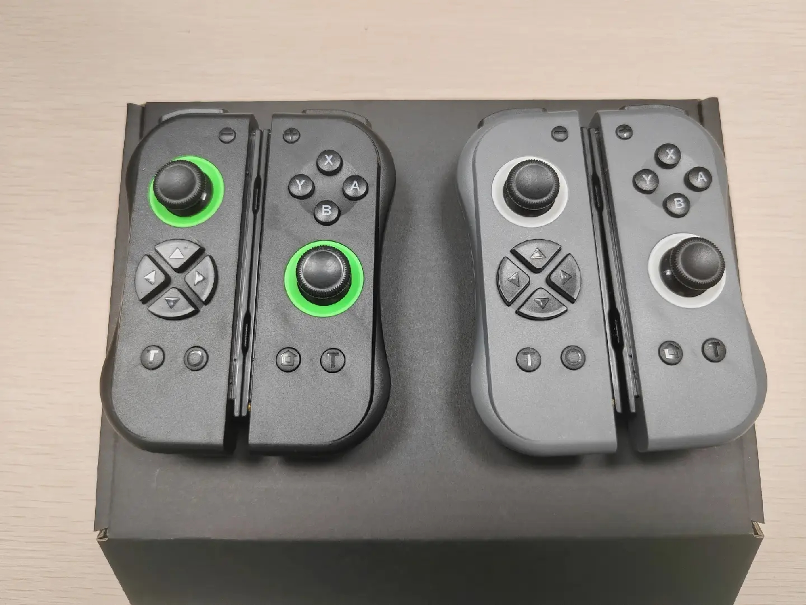

<p align="center">
  
</p>

# Joycon-Robotics: Low-Cost, Convenient Teleoperation for One- and Two-Arm Robots

<p align="center">
  <a href="README.md">English</a> •
  <a href="README_zh.md">中文</a>
</p>

---

## 🆕 What's New?
- **2025-12-24**: Added hidapi_for_windows/README_hidapi.md to enable the core functionality of this repository to be used on Windows.  
- **2025-12-05**: Added the `all_button_return` parameter, allowing joyconrobotics to output encoded values for all buttons by default.
- **2025-04-19**: Added support for initial parameters for all robot arms + updated [Chinese documentation](README_zh.md)
- **2025-04-16**: Optimized yaw drift compensation with more robust auto-calibration  
- **2025-02-24**: Added compatibility with [Robosuite](https://github.com/box2ai-robotics/robosuite-joycon)  
- **2025-02-12**: Added support for [RLBench-ACT](https://github.com/box2ai-robotics/joycon-robotics) data collection

---

## 💻 Installation (Recommended: Ubuntu 20.04 / 22.04 with Bluetooth)

```bash
git clone https://github.com/box2ai-robotics/joycon-robotics.git
cd joycon-robotics

pip install -e .
sudo apt-get update
sudo apt-get install -y dkms libevdev-dev libudev-dev cmake git
make install
```

---

## 🔗 Connection Setup

### 1. Initial Bluetooth Pairing

1. **Enter Pairing Mode**
   - Hold the small circular button on the Joy-Con for 3 seconds.
   - In your system Bluetooth settings, connect to `Joycon (L)` or `Joycon (R)`.

<p align="center">
  
</p>

2. **Confirm Connection**
   - Joy-Con will vibrate when connected.
   - **Single Controller Mode**: Hold `R + ZR` for 3 seconds.
   - **Dual Controller Mode**: After both Joy-Cons vibrate, press:
     - Left: `L` (upper trigger)  + Right: `R` (upper trigger)

<p align="center">
  
</p>

### 2. Reconnecting

- For already paired devices, press `L` or `R` to auto-reconnect.
- Wait for vibration confirmation and repeat step 2 above.

---

## ⚡ Quick Start

### 1. Basic Usage

```python
from joyconrobotics import JoyconRobotics
import time

joyconrobotics_right = JoyconRobotics("right")

for i in range(1000):
    pose, gripper, control_button = joyconrobotics_right.get_control()
    print(f'{pose=}, {gripper=}, {control_button=}')
    time.sleep(0.01)

joyconrobotics_right.disconnnect()
```

---

### 2. Custom Parameters for Robot Arms

```python
# Initial pose [x, y, z, roll, pitch, yaw]
init_gpos = [0.210, -0.4, -0.047, -3.1, -1.45, -1.5]

# Pose limits: [[min], [max]]
glimit = [
    [0.210, -0.4, -0.047, -3.1, -1.45, -1.5],
    [0.420, 0.4, 0.30, 3.1, 1.45, 1.5]
]

offset_position_m = init_gpos[:3]
```

---

### 3. Lightweight Collaborative Arms (e.g., ViperX 300S, So-100 Plus)

```python
JR_controller = JoyconRobotics(
    device="right",
    glimit=glimit,
    offset_position_m=offset_position_m,
    pitch_down_double=True,
    gripper_close=-0.15,
    gripper_open=0.5
)
```

---

### 4. Industrial Arms (e.g., UR, Panda, Sawyer)

```python
import math

JR_controller = JoyconRobotics(
    device="right",
    offset_position_m=offset_position_m,
    pitch_down_double=False,
    offset_euler_rad=[0, -math.pi, 0],
    euler_reverse=[1, -1, 1],
    direction_reverse=[-1, 1, 1],
    pure_xz=False
)
```

👉 More code examples: [Quick Start Tutorial Notebook](joyconrobotics_tutorial.ipynb)

---

## 🎮 Control Manual

### Coordinate System

- Home: `(offset_position_x, offset_position_y, offset_position_z)`
- Forward: `X+`
- Right: `Y+`
- Up: `Z+`

---

### End-Effector Attitude Control

| Action | Direction |
|--------|-----------|
| Joystick ↑         | Forward (X+)      |
| Joystick ↓         | Backward (X−)     |
| Joystick ←         | Strafe Left (Y−)  |
| Joystick →         | Strafe Right (Y+) |
| Joystick ● (Press) | Down (Z−)         |
| R/L                | Up (Z+)           |

---

### Button Mapping

<p align="center">
  
</p>

| Function         | Left Joycon         | Right Joycon        |
|------------------|---------------------|----------------------|
| **Reset Pose**   | `Capture (O)`       | `Home`              |
| **Gripper**      | `ZL`                | `ZR`                |
| **Delete and Record**  | —                   | `Y` *(custom)*      |
| **Save and Record New** | —                   | `A` *(custom)*      |

*All other buttons are user-configurable.*

---

## ❓ FAQ

### Q1: No Vibration / Can't Connect
**Solution:**
1. Re-run `make install`  
2. Remove and re-pair Bluetooth devices  
3. Restart your computer  
4. Fully power off Joy-Con, re-enter pairing mode

---

### Q2: Frequent Disconnection or Data Loss  
**Solution:**
- Charge Joy-Con for 30+ minutes  
- ``Remove the Bluetooth pairing info from your computer``
- Restart both computer and Joy-Con  
- ⚠ Ubuntu Bluetooth compatibility can vary by device

### Q3: Fixes and Adaptation for Ubuntu 24.04
**Solution:**
- Modify the file that conflicts with the kernel:
```bash
sudo gedit /var/lib/dkms/nintendo/3.2/source/src/hid-nintendo.c
# Change `#include <asm/unaligned.h>` to `#include <linux/unaligned.h>`

# Rebuild
sudo dkms install nintendo/3.2

. script/fix_ubuntu_24_04.sh
make install
```

### Q4: On Ubuntu 22.04 the Joy-Con vibrates once then stops (incorrect)
**Solution:**
- Disable VT (Intel Virtualization Technology) in your BIOS.
- Run the auto-setup diagnostic script:
```bash
. auto_setup_joycon.sh
```

### Q5: Computer has a Bluetooth adapter but cannot connect
**Solution:**
- Disable Secure Boot in the BIOS (typically enter BIOS by rebooting and pressing F2).

---

## 💡 Compatibility

| System           | Supported |
|------------------|-----------|
| Ubuntu 20.04     | ✅        |
| Ubuntu 22.04     | ✅        |
| Windows / WSL / Mac / VM | ❌ *(due to kernel-level drivers)* |

---

## 📦 Hardware Purchase
<p align="center">
  
</p>

- **China Mainland:**  
  淘宝店铺 👉 [盒子桥淘宝店铺](https://item.taobao.com/item.htm?id=906794552661)

- **International Users:**  
  Via AIFITLAB 👉 [Purchase Link](https://aifitlab.com/products/joycon-robotics-controller)
---

## 📢 Community & Support

- Video Tutorials: [Bilibili 视频账号](https://space.bilibili.com/122291348)  
- QQ交流群：948755626  
- Open-source license: For research/robotics use only. **Strictly prohibited** for gaming or Nintendo systems.  
- Use at your own risk — no warranty provided.

---

If you find this project helpful, **please star the repo**! ⭐⭐⭐⭐⭐

