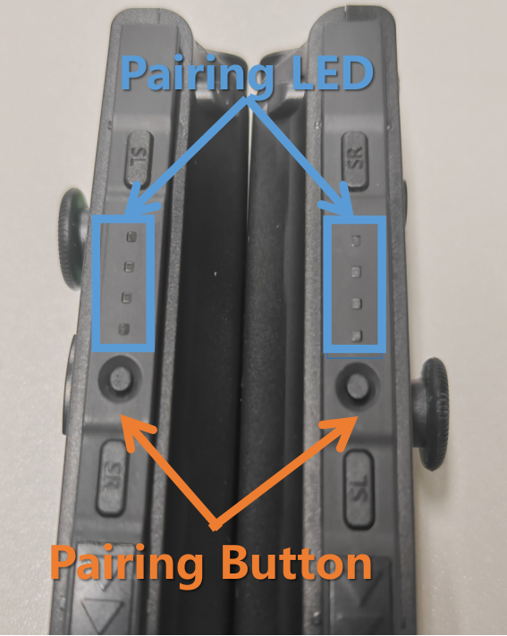
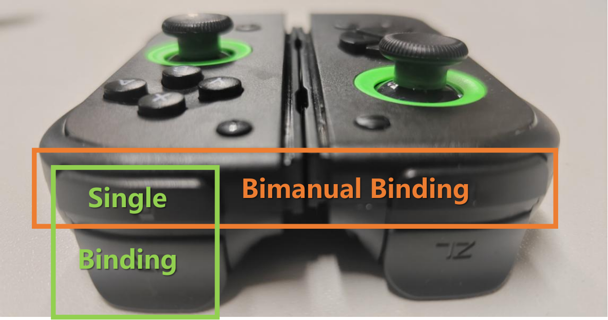
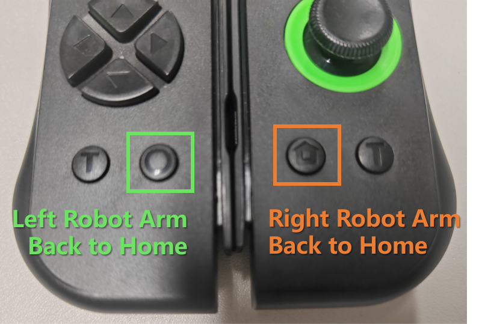

# Joycon-Robotics：低成本、便捷的单/双机械臂遥操作系统

<p align="center">
  <a href="README.md">English</a> •
  <a href="README_zh.md">中文</a>
</p>

---

## 🆕 最新动态
- **2025-12-24**: 增加 [hidapi_for_windows](hidapi_for_windows/README_hidapi.md) 使该仓库的核心原理可以再Windows下使用。
- **2025-12-05**: 增加 `all_button_return` 参数，使joyconrobotics可以默认输出所有按键的编码
- **2025-04-19**：新增全机型初始参数支持 + 更新[中文文档](README_zh.md)  
- **2025-04-16**：优化偏航漂移补偿算法，自动校准更鲁棒  
- **2025-02-24**：新增 [Robosuite](https://github.com/box2ai-robotics/robosuite-joycon) 兼容支持  
- **2025-02-12**：支持 [RLBench-ACT](https://github.com/box2ai-robotics/joycon-robotics) 数据采集

---

## 💻 安装指南（推荐：Ubuntu 20.04/22.04 + 蓝牙）

```bash
git clone https://github.com/box2ai-robotics/joycon-robotics.git
cd joycon-robotics

pip install -e .
sudo apt-get update
sudo apt-get install -y dkms libevdev-dev libudev-dev cmake
make install
```

---

## 🔗 连接设置

### 1. 首次蓝牙配对

1. **进入配对模式**
   - 长按Joy-Con侧边圆形按钮3秒
   - 在系统蓝牙设置中连接 `Joycon (L)` 或 `Joycon (R)`

<p align="center">
  
</p>

2. **绑定**
   - 连接成功时Joy-Con会震动
   - **单控制器模式**：同时长按 `R + ZR`（上下两个肩键） 3秒
   - **双控制器模式**：双Joy-Con震动后同时按下：
     - 左控制器的`L`（顶部肩键） + 右控制器的`R`（顶部肩键）

<p align="center">
  
</p>

### 2. 重新连接

- 已配对设备按 `L` 或 `R` 键自动重连
- 等待震动提示后重复上述步骤2

---

## ⚡ 快速开始

### 1. 基础用法

```python
from joyconrobotics import JoyconRobotics
import time

joyconrobotics_right = JoyconRobotics("right")

for i in range(1000):
    pose, gripper, control_button = joyconrobotics_right.get_control()
    print(f'{pose=}, {gripper=}, {control_button=}')
    time.sleep(0.01)

joyconrobotics_right.disconnnect()
```

---

### 2. 机械臂自定义参数

```python
# 初始位姿 [x, y, z, roll, pitch, yaw]
init_gpos = [0.210, -0.4, -0.047, -3.1, -1.45, -1.5]

# 位姿限制：[[最小值], [最大值]]
glimit = [
    [0.210, -0.4, -0.047, -3.1, -1.45, -1.5],
    [0.420, 0.4, 0.30, 3.1, 1.45, 1.5]
]

offset_position_m = init_gpos[:3]
```

---

### 3. 轻型协作臂（如ViperX 300S、So-100 Plus）

```python
JR_controller = JoyconRobotics(
    device="right",
    glimit=glimit,
    offset_position_m=offset_position_m,
    pitch_down_double=True,
    gripper_close=-0.15,
    gripper_open=0.5
)
```

---

### 4. 工业级机械臂（如UR、Panda、Sawyer）

```python
import math

JR_controller = JoyconRobotics(
    device="right",
    offset_position_m=offset_position_m,
    pitch_down_double=False,
    offset_euler_rad=[0, -math.pi, 0],
    euler_reverse=[1, -1, 1],
    direction_reverse=[-1, 1, 1],
    pure_xz=False
)
```

👉 更多示例代码：[快速入门教程](joyconrobotics_tutorial.ipynb)

---

## 🎮 操作手册

### 坐标系定义

- 原点：`(offset_position_x, offset_position_y, offset_position_z)`
- 前进方向：`X+`
- 右侧方向：`Y+`
- 上方方向：`Z+`

---

### 末端执行器姿态控制

| 操作         | 方向               |
|--------------|--------------------|
| 摇杆 ↑       | 前进 (X+)          |
| 摇杆 ↓       | 后退 (X−)          |
| 摇杆 ←       | 左移 (Y−)          |
| 摇杆 →       | 右移 (Y+)          |
| 摇杆按压 ●   | 下降 (Z−)          |
| R/L键        | 上升 (Z+)          |

---

### 按键映射

<p align="center">
  
</p>

| 功能           | 左Joycon           | 右Joycon            |
|----------------|--------------------|---------------------|
| **位姿复位**   | `Capture (O)`      | `Home`              |
| **夹爪控制**    | `ZL`               | `ZR`                |
| **重新录制**    | —                  | `Y` *(可自定义)*    |
| **保存录制并开始下一条**    | —                  | `A` *(可自定义)*    |

*其他所有按键均可自定义功能*

---

## ❓ 常见问题

### Q1：无震动反馈/无法连接
**解决方案：**
1. 重新运行 `make install`  
2. 删除并重新配对蓝牙设备  
3. 重启计算机  
4. 完全关闭Joy-Con电源后重新进入配对模式

---

### Q2：频繁断连或数据丢失  
**解决方案：**
- 为Joy-Con充电30分钟以上  
- ``删除计算机上的蓝牙配对信息``  
- 同时重启计算机和Joy-Con  
- ⚠ Ubuntu蓝牙兼容性因设备而异

### Q3: Ubuntu 24.04 修复与适配
**解决方案：**
- 修改因内核冲突的文件
```bash
sudo gedit /var/lib/dkms/nintendo/3.2/source/src/hid-nintendo.c
# 把#include <asm/unaligned.h>改成#include <linux/unaligned.h>

# 重新编译
sudo dkms install nintendo/3.2

. script/fix_ubuntu_24_04.sh
make install
```

### 04: Ubuntu22.04 蓝牙连上之后只震动一下就停止震动（不正确）
**解决方案：**
- 关闭VT（ Intel Virtualization Technology 英特尔虚拟化技术）
- 运行 auto_setup_joycon.sh检修测试
```bash
. script/auto_setup_joycon.sh
```

### 05: 电脑有蓝牙适配器，但是连不上蓝牙
**解决方案：**
- 进入BIOS关闭安全启动（用常识关机重启按F2）

---

## 💡 兼容性列表

| 系统           | 支持状态 |
|----------------|----------|
| Ubuntu 20.04   | ✅       |
| Ubuntu 22.04   | ✅       |
| Windows/WSL/Mac/虚拟机 | ❌ *(需内核级驱动支持)* |

---

## 📦 硬件购买

- **中国大陆用户：**  
  淘宝店铺 👉 [盒子桥淘宝店铺](https://item.taobao.com/item.htm?id=906794552661)

- **国际用户：**  
  通过AIFITLAB购买 👉 [购买链接](https://aifitlab.com/products/joycon-robotics-controller)

---

## 📢 社区支持

- 视频教程：[Bilibili频道](https://space.bilibili.com/122291348)  
- QQ交流群：948755626  
- 开源协议：仅限研究/机器人用途，**严禁**用于游戏或任天堂系统  
- 免责声明：使用风险自负，不提供任何担保

---

如果觉得本项目有帮助，**请给仓库点个Star**！ ⭐⭐⭐⭐⭐